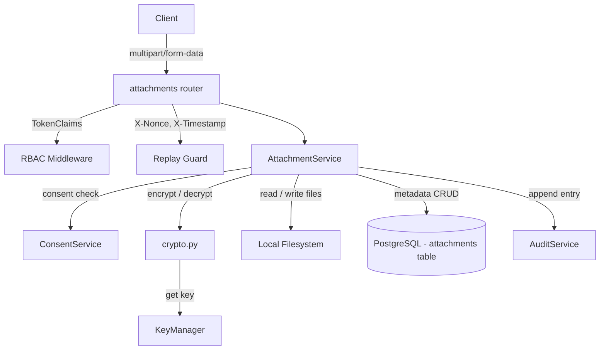

# Design Document: Medical Record Attachments

## Overview

This feature adds file attachment support (images, PDFs, DICOM) to the existing medical records system. Attachments are encrypted at rest with AES-256-GCM using the same `RECORD_ENCRYPTION_KEY` managed by `KeyManager`, stored on the local filesystem with UUID-based filenames, and tracked via a new `attachments` database table linked to `medical_records`. Access control reuses the existing consent model and RBAC middleware. The upload endpoint accepts multipart form data; the download endpoint streams decrypted bytes. All mutating operations are replay-protected and audit-logged.

The design intentionally mirrors the patterns already established in `records_service.py`, `crypto.py`, and the router layer so that the new code feels like a natural extension of the existing system rather than a bolt-on.

---

## Architecture



The attachment flow sits alongside the existing records flow. The router validates auth + replay headers, delegates to `AttachmentService`, which orchestrates:

1. Access control (consent check via `ConsentService`, role check)
2. File validation (MIME type, size, content-sniffing)
3. Encryption/decryption (via `crypto.encrypt` / `crypto.decrypt`)
4. Filesystem I/O (write/read encrypted bytes under `ATTACHMENT_STORAGE_PATH`)
5. Database metadata (insert/query/soft-delete rows in `attachments`)
6. Audit logging (via `AuditService.append`)

---

## Components and Interfaces

### 1. Configuration (`app/core/config.py`)

Two new settings added to the `Settings` class:

| Setting | Type | Default | Description |
|---|---|---|---|
| `ATTACHMENT_STORAGE_PATH` | `str` | `"attachments"` | Directory for encrypted files |
| `MAX_ATTACHMENT_SIZE_MB` | `int` | `20` | Max upload size in MB |

On startup (in `lifespan`), the app ensures the storage directory exists with `0o700` permissions.

### 2. Database Model (`app/models/attachment.py`)

New SQLAlchemy ORM model `Attachment` mapped to the `attachments` table. See Data Models section for column details.

### 3. Pydantic Schemas (`app/schemas/attachments.py`)

| Schema | Purpose |
|---|---|
| `AttachmentOut` | Response model for single attachment metadata |
| `AttachmentListOut` | List wrapper (just `list[AttachmentOut]`) |

`AttachmentOut` fields: `id`, `record_id`, `original_filename`, `mime_type`, `file_size_bytes`, `uploaded_by`, `created_at`, `updated_at`.

### 4. Service Layer (`app/services/attachment_service.py`)

`AttachmentService` class with these methods:

| Method | Signature | Description |
|---|---|---|
| `upload` | `(db, actor, record_id, file, client_ip) -> AttachmentOut` | Validate → encrypt → write file → insert row → audit |
| `download` | `(db, actor, attachment_id, client_ip) -> tuple[bytes, str, str]` | Auth check → read file → decrypt → audit → return `(content, mime_type, filename)` |
| `list_attachments` | `(db, actor, record_id, client_ip) -> list[AttachmentOut]` | Auth check → query non-deleted rows for non-deleted record |
| `delete` | `(db, actor, attachment_id, client_ip) -> dict` | Doctor-only → soft-delete row → audit |

Internal helpers:
- `_check_attachment_read_access(actor, record, has_consent)` — mirrors `_check_read_access` in `records_service.py`
- `_check_attachment_write_access(actor, record, has_consent)` — mirrors `_check_write_access`; additionally blocks Patient and Nurse
- `_validate_file(file: UploadFile)` — checks MIME type allowlist, file size, content-sniff
- `_check_consent(db, actor, patient_id)` — delegates to `ConsentService.check_active_grant`

### 5. Router (`app/routers/attachments.py`)

All endpoints nested under `/records/{record_id}/attachments`:

| Method | Path | Auth | Replay Guard | Description |
|---|---|---|---|---|
| `POST` | `/records/{record_id}/attachments` | `Doctor, Nurse, Lab_Technician` via `require_roles` — but Nurse blocked in service | Yes | Upload attachment |
| `GET` | `/records/{record_id}/attachments` | `get_current_user` | No | List attachments |
| `GET` | `/records/{record_id}/attachments/{attachment_id}` | `get_current_user` | No | Download attachment |
| `DELETE` | `/records/{record_id}/attachments/{attachment_id}` | `require_roles("Doctor")` | Yes | Soft-delete attachment |

The upload endpoint uses FastAPI's `UploadFile` for multipart handling. The download endpoint returns a `StreamingResponse` with `Content-Type` and `Content-Disposition` headers.

### 6. Alembic Migration (`alembic/versions/003_attachments.py`)

New migration script creating the `attachments` table and indexes. Depends on revision `002`.

### 7. MIME Validation

Content-sniffing uses Python's `python-magic` library (libmagic bindings) to read the first bytes of the uploaded file and verify the detected MIME type matches the declared `Content-Type`. This prevents MIME spoofing attacks where a malicious file is uploaded with a benign content-type header.

Allowed MIME types: `image/jpeg`, `image/png`, `image/dicom`, `application/pdf`, `image/tiff`.

---

## Data Models

### `attachments` Table

| Column | Type | Constraints | Description |
|---|---|---|---|
| `id` | `UUID` | PK, default `uuid4` | Attachment identifier |
| `record_id` | `UUID` | FK → `medical_records.id`, NOT NULL | Parent medical record |
| `original_filename` | `VARCHAR(255)` | NOT NULL | User-provided filename (for Content-Disposition on download) |
| `mime_type` | `VARCHAR(100)` | NOT NULL | Validated MIME type |
| `file_size_bytes` | `BIGINT` | NOT NULL | Size of the original plaintext file |
| `storage_filename` | `VARCHAR(36)` | NOT NULL, UNIQUE | UUID filename on disk (no extension) |
| `iv` | `BYTEA` | NOT NULL | 12-byte AES-GCM initialisation vector |
| `tag` | `BYTEA` | NOT NULL | 16-byte AES-GCM authentication tag |
| `uploaded_by` | `UUID` | FK → `users.id`, NOT NULL | User who uploaded |
| `is_deleted` | `BOOLEAN` | NOT NULL, default `FALSE` | Soft-delete flag |
| `created_at` | `TIMESTAMPTZ` | NOT NULL, default `now()` | Upload timestamp |
| `updated_at` | `TIMESTAMPTZ` | NOT NULL, default `now()` | Last modification timestamp |

Indexes:
- `idx_att_record_id` on `record_id` — fast lookup by parent record
- `idx_att_uploaded_by` on `uploaded_by` — Lab_Technician access checks
- `idx_att_storage_filename` on `storage_filename` (unique) — filesystem lookups

### SQLAlchemy Model

```python
class Attachment(Base):
    __tablename__ = "attachments"

    id: Mapped[uuid.UUID] = mapped_column(UUID(as_uuid=True), primary_key=True, default=uuid.uuid4)
    record_id: Mapped[uuid.UUID] = mapped_column(UUID(as_uuid=True), ForeignKey("medical_records.id"), nullable=False)
    original_filename: Mapped[str] = mapped_column(String(255), nullable=False)
    mime_type: Mapped[str] = mapped_column(String(100), nullable=False)
    file_size_bytes: Mapped[int] = mapped_column(BigInteger, nullable=False)
    storage_filename: Mapped[str] = mapped_column(String(36), nullable=False, unique=True)
    iv: Mapped[bytes] = mapped_column(LargeBinary, nullable=False)
    tag: Mapped[bytes] = mapped_column(LargeBinary, nullable=False)
    uploaded_by: Mapped[uuid.UUID] = mapped_column(UUID(as_uuid=True), ForeignKey("users.id"), nullable=False)
    is_deleted: Mapped[bool] = mapped_column(Boolean, nullable=False, default=False)
    created_at: Mapped[datetime] = mapped_column(DateTime(timezone=True), nullable=False, default=datetime.utcnow)
    updated_at: Mapped[datetime] = mapped_column(DateTime(timezone=True), nullable=False, default=datetime.utcnow, onupdate=datetime.utcnow)
```

### Filesystem Layout

```
{ATTACHMENT_STORAGE_PATH}/
  ├── a1b2c3d4-e5f6-7890-abcd-ef1234567890   ← encrypted bytes, no extension
  ├── f9e8d7c6-b5a4-3210-fedc-ba0987654321
  └── ...
```

No subdirectories. Each file is named by its `storage_filename` UUID. The original filename, MIME type, and crypto parameters are stored only in the database row.

---


## Correctness Properties

*A property is a characteristic or behavior that should hold true across all valid executions of a system — essentially, a formal statement about what the system should do. Properties serve as the bridge between human-readable specifications and machine-verifiable correctness guarantees.*

### Property 1: Encryption round-trip preserves file bytes

*For any* byte sequence of length 1 to 20 MB, encrypting it with AES-256-GCM via `crypto.encrypt` and then decrypting the result with `crypto.decrypt` using the same key SHALL produce byte-for-byte identical output.

**Validates: Requirements 6.6**

### Property 2: Upload-download round-trip preserves file content

*For any* valid file content (bytes of length 1 to Max_File_Size with a MIME type in Allowed_MIME_Types), uploading the file via `AttachmentService.upload` and then downloading it via `AttachmentService.download` SHALL return bytes identical to the original file content.

**Validates: Requirements 2.4**

### Property 3: Invalid MIME types are rejected

*For any* MIME type string that is not in the Allowed_MIME_Types set (`image/jpeg`, `image/png`, `image/dicom`, `application/pdf`, `image/tiff`), the attachment upload validation SHALL reject the file and no file SHALL be persisted to disk or database.

**Validates: Requirements 1.2**

### Property 4: MIME content-sniff mismatch is rejected

*For any* file upload where the declared MIME type does not match the MIME type detected by content-sniffing the file bytes, the attachment upload validation SHALL reject the file.

**Validates: Requirements 1.5**

### Property 5: Storage filename does not leak sensitive information

*For any* uploaded attachment, the `storage_filename` SHALL be a valid UUID4 string and SHALL NOT contain any substring of the original filename, the patient ID, or the parent record ID.

**Validates: Requirements 1.6**

### Property 6: Crypto metadata invariants

*For any* uploaded attachment, the stored IV SHALL be exactly 12 bytes, the stored authentication tag SHALL be exactly 16 bytes, and *for any* two distinct attachments, their IVs SHALL be different.

**Validates: Requirements 6.1, 6.3**

### Property 7: Encrypted bytes on disk differ from plaintext

*For any* non-empty file upload, the bytes written to the filesystem SHALL NOT be equal to the original plaintext file content.

**Validates: Requirements 6.5**

### Property 8: Read-only roles can read but not write attachments

*For any* user with a read-only role (a Patient accessing their own record, or a Nurse with an active consent grant), download and list operations SHALL succeed, and upload and delete operations SHALL be denied with HTTP 403.

**Validates: Requirements 5.1, 5.4**

### Property 9: Doctor access is gated by active consent

*For any* Doctor and any Patient's medical record, the Doctor SHALL be permitted to perform attachment operations if and only if an active, non-expired consent grant exists between the Doctor and the Patient. Without active consent, all operations SHALL return HTTP 403 with "Active consent required".

**Validates: Requirements 5.2, 5.3**

### Property 10: Lab_Technician access requires record ownership

*For any* Lab_Technician and any medical record, the Lab_Technician SHALL be permitted to access attachments if and only if the Lab_Technician is the `created_by` user of the parent medical record. Otherwise, access SHALL be denied with HTTP 403.

**Validates: Requirements 5.5**

### Property 11: Attachment listing contains all required metadata fields

*For any* set of non-deleted attachments on a non-deleted medical record, the list-attachments response SHALL include for each attachment: attachment ID, original filename, MIME type, file size in bytes, uploader user ID, and upload timestamp.

**Validates: Requirements 3.1**

### Property 12: Soft-deleted attachments are excluded from listings

*For any* medical record with a mix of active and soft-deleted attachments, the list-attachments response SHALL contain only the active (non-deleted) attachments.

**Validates: Requirements 3.3**

### Property 13: Soft-deleted parent record excludes attachments from queries

*For any* medical record that has been soft-deleted, listing attachments for that record SHALL return HTTP 404, and the attachment rows in the database SHALL NOT be cascade-deleted.

**Validates: Requirements 8.3**

---

## Error Handling

| Scenario | HTTP Status | Error Detail | Notes |
|---|---|---|---|
| File MIME type not in allowlist | 422 | `"File type not allowed. Allowed: image/jpeg, image/png, image/dicom, application/pdf, image/tiff"` | Checked before any I/O |
| File size exceeds Max_File_Size | 413 | `"File too large. Maximum size: {MAX_ATTACHMENT_SIZE_MB} MB"` | Checked before encryption |
| MIME content-sniff mismatch | 422 | `"File content does not match declared MIME type"` | Content-sniffing via python-magic |
| Medical record not found / soft-deleted | 404 | `"Record not found"` | Consistent with existing records endpoints |
| Attachment not found / soft-deleted | 404 | `"Attachment not found"` | |
| Patient attempts upload or delete | 403 | `"Patients have read-only access to attachments"` | |
| Nurse attempts upload or delete | 403 | `"Nurses have read-only access"` | Consistent with existing records_service |
| Doctor without active consent | 403 | `"Active consent required"` | Consistent with existing records_service |
| Lab_Technician not record creator | 403 | `"Access denied"` | Consistent with existing records_service |
| Non-Doctor attempts delete | 403 | `"Access denied"` | |
| Decryption failure (tampered file) | 500 | `"Attachment data integrity error"` | Logged; indicates storage corruption |
| Filesystem write failure | 500 | `"Failed to store attachment"` | Logged; encrypted bytes cleaned up on failure |
| Filesystem read failure | 500 | `"Failed to retrieve attachment"` | Logged |
| Missing replay headers | 400 | `"Invalid timestamp format"` / `"Nonce already used"` | Handled by existing ReplayGuard |

**Cleanup on failure**: If the database insert succeeds but the filesystem write fails (or vice versa), the service rolls back both. The DB transaction rollback is handled by the `get_db` dependency's exception handler. If the file was written before a DB error, the service deletes the orphaned file in a `try/finally` block.

---

## Testing Strategy

### Property-Based Tests (Hypothesis)

The project already uses Hypothesis (`.hypothesis/` directory exists). Each correctness property maps to one property-based test with a minimum of 100 iterations.

| Test | Property | Library | Iterations |
|---|---|---|---|
| `test_crypto_roundtrip_attachment_bytes` | Property 1 | Hypothesis | 100+ |
| `test_upload_download_roundtrip` | Property 2 | Hypothesis + mocked filesystem | 100+ |
| `test_invalid_mime_rejected` | Property 3 | Hypothesis | 100+ |
| `test_mime_sniff_mismatch_rejected` | Property 4 | Hypothesis | 100+ |
| `test_storage_filename_opacity` | Property 5 | Hypothesis | 100+ |
| `test_crypto_metadata_invariants` | Property 6 | Hypothesis | 100+ |
| `test_disk_bytes_not_plaintext` | Property 7 | Hypothesis | 100+ |
| `test_readonly_role_access_control` | Property 8 | Hypothesis | 100+ |
| `test_doctor_consent_gated_access` | Property 9 | Hypothesis | 100+ |
| `test_lab_tech_creator_access` | Property 10 | Hypothesis | 100+ |
| `test_listing_metadata_fields` | Property 11 | Hypothesis | 100+ |
| `test_soft_deleted_excluded_from_listing` | Property 12 | Hypothesis | 100+ |
| `test_soft_deleted_record_excludes_attachments` | Property 13 | Hypothesis | 100+ |

Each test is tagged with: `# Feature: medical-record-attachments, Property N: <property_text>`

### Unit Tests (Example-Based)

| Test | Validates |
|---|---|
| Upload with non-existent record ID → 404 | Req 1.4 |
| Upload with soft-deleted record ID → 404 | Req 1.4 |
| Download non-existent attachment → 404 | Req 2.2 |
| Download soft-deleted attachment → 404 | Req 2.2 |
| Delete non-existent attachment → 404 | Req 4.3 |
| Doctor with consent deletes → 200, is_deleted=True | Req 4.1 |
| List on non-existent record → 404 | Req 3.2 |
| Config defaults: ATTACHMENT_STORAGE_PATH="attachments", MAX_ATTACHMENT_SIZE_MB=20 | Req 7.2, 7.4 |
| Directory auto-creation with 0o700 permissions | Req 7.3 |
| .env.example contains new entries | Req 7.5 |
| Access control before file read (mock FS, verify no read on 403) | Req 5.6 |

### Smoke Tests

| Test | Validates |
|---|---|
| Upload without replay headers → 400 | Req 1.8 |
| Delete without replay headers → 400 | Req 4.5 |
| AttachmentService uses `get_record_key()` | Req 6.4 |
| Attachments table has correct columns and indexes | Req 8.1, 8.2 |
| Alembic migration runs upgrade/downgrade cleanly | Req 8.4 |

### Integration Tests

| Test | Validates |
|---|---|
| Full upload flow: multipart → encrypt → store → DB → audit entry | Req 1.1, 1.7 |
| Full download flow: auth → read → decrypt → stream response with headers | Req 2.1, 2.3 |
| Delete flow: soft-delete → audit entry | Req 4.4 |
